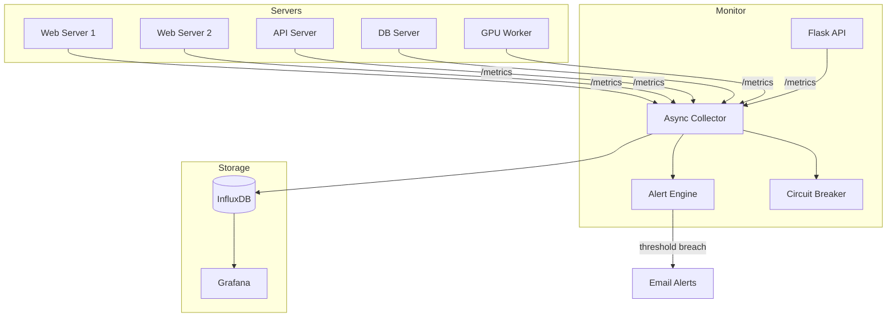

# Cloud Native Monitoring System

Monitoring service that tracks CPU, GPU, memory, disk, and network metrics across multiple servers. Sends email alerts when resources cross configurable thresholds (default 80%). Metrics are stored in InfluxDB and visualized through Grafana.

Ran this for ~3 months across 10 servers. Maintained 99.8% uptime and caught 15+ resource overload events before they turned into actual outages.

## Architecture



## What's in here

- Async metric collection across 10+ servers using `asyncio` / `aiohttp`
- Circuit breaker on the collector — backs off unreachable hosts instead of hammering them
- Threshold-based alerting with cooldown (won't spam you with the same alert every 30s)
- HTML email notifications via SMTP with Jinja2 templates
- InfluxDB for time-series storage, Grafana for dashboards (both provisioned automatically)
- JSON structured logging (plugs straight into CloudWatch Logs Insights)
- Graceful shutdown handling (SIGTERM/SIGINT)
- Health check endpoint for ECS container orchestration

## Stack

| | |
|---|---|
| Python 3.11 | psutil, GPUtil, asyncio, aiohttp, Flask |
| Storage | InfluxDB 2.7 |
| Dashboards | Grafana 10.2 |
| Alerting | SMTP + Jinja2 templates |
| Containers | Docker (multi-stage build), Docker Compose |
| Infra | Terraform (ECS, ECR, IAM, SNS, CloudWatch) |
| CI/CD | GitHub Actions |

## Getting started

```bash
git clone https://github.com/Toyinolu/cloud-monitor.git
cd cloud-monitor

# set up env vars
cp .env.example .env
# edit .env with your values

# spin up everything
docker compose up -d
```

This starts the monitor, InfluxDB, and Grafana together. After it's up:

- **Monitor API**: http://localhost:5000/health
- **Grafana**: http://localhost:3000 (admin/admin)
- **InfluxDB**: http://localhost:8086

### Running tests

```bash
pip install -r requirements.txt
python -m pytest tests/ -v --cov=src
```

### Running locally without Docker

```bash
pip install -r requirements.txt
python main.py
```

## Deploying to AWS

### Provision infra

```bash
cd terraform
terraform init
terraform plan -var="alert_email=your@email.com" -var="influxdb_token=your-token"
terraform apply
```

### Push image to ECR

```bash
aws ecr get-login-password --region us-east-1 | docker login --username AWS --password-stdin <account-id>.dkr.ecr.us-east-1.amazonaws.com

docker build -t cloud-monitor .
docker tag cloud-monitor:latest <account-id>.dkr.ecr.us-east-1.amazonaws.com/cloud-monitor:latest
docker push <account-id>.dkr.ecr.us-east-1.amazonaws.com/cloud-monitor:latest
```

### CI/CD

Pushing to `main` triggers the GitHub Actions pipeline: lint (flake8) -> test (pytest) -> build -> push to ECR -> deploy to ECS.

You'll need to set `AWS_ACCESS_KEY_ID` and `AWS_SECRET_ACCESS_KEY` as GitHub secrets.

## Configuration

Everything is in `config.yaml`. Alert thresholds, polling intervals, server inventory, SMTP settings — all configurable without touching code. Sensitive values (tokens, passwords) are pulled from environment variables.

```yaml
monitor:
  poll_interval: 30
  mode: "local"  # or "remote" to poll other servers

alerts:
  cooldown_seconds: 300
  rules:
    - metric: "cpu_percent"
      operator: ">"
      threshold: 80.0
      severity: "warning"
```

## Project layout

```
src/
  collector/     # metrics collection (local psutil + remote async HTTP)
  alerting/      # threshold evaluation + email notifications
  api/           # Flask endpoints (/health, /metrics, /alerts)
  storage/       # InfluxDB writer
  config/        # YAML config loader with env var substitution
tests/           # pytest suite
grafana/         # pre-provisioned dashboard + datasource configs
terraform/       # AWS infra (ECS, ECR, IAM, SNS, CloudWatch)
.github/         # CI/CD workflow
```
